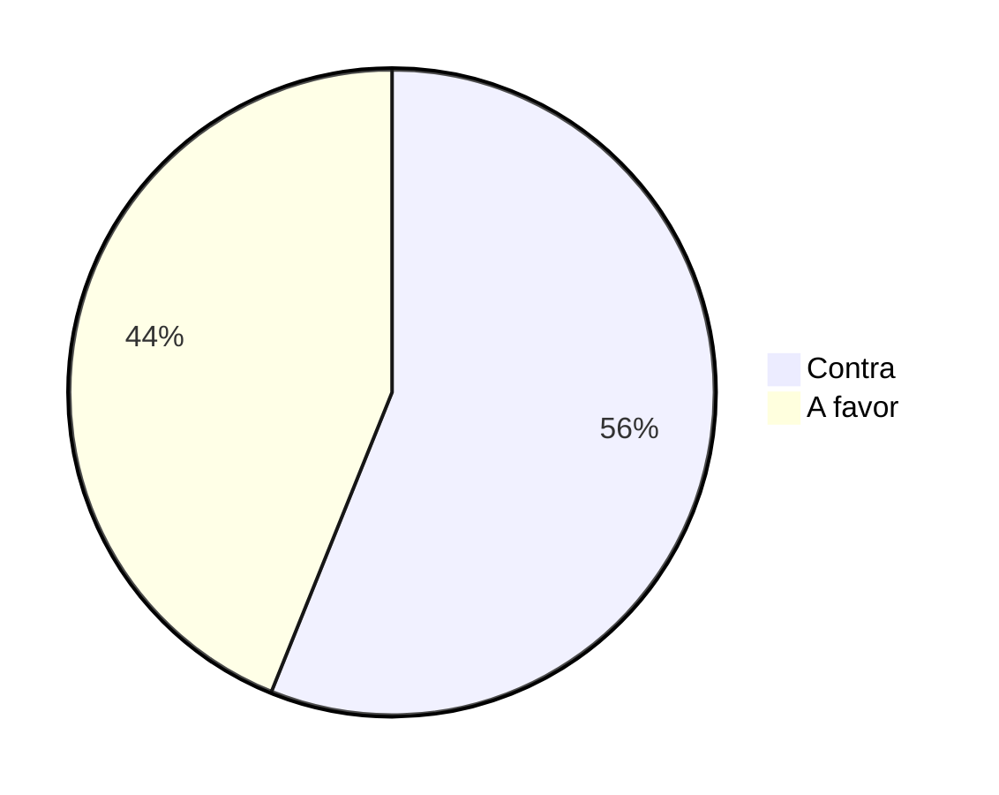

# debates-ideologicos
Repositório contendo comentários de páginas públicas do facebook sobre a temática da legalização do aborto no Brasil

# Informações do conjunto de dados

O conjunto de dados foi concebido através de extracao de comentários de páginas públicas no Facebook no ano de 2016 e 2017.

Nesse sentido, este trabalho propõe um banco de dados para classificação e análise de sentimentos de comentários de debates ideológicos sobre a legalização do aborto no Brasil, os textos contidos são em português brasileiro e contêm informações sobre debates ideológicos em mídias sociais, neste caso extraídos de páginas públicas no facebook. Cada comentário foi rotulado por pelo menos três pessoas, os rótulos presentes são: A favor e contra. 

Ao final, os comentários contendo duas ou mais avaliações foram separados, garantindo assim a qualidade da avaliação, todos os comentários da base de dados foram curados por no mínimo 3 pessoas, havendo uma quarta pessoa em caso de empate. A base de dados disponível neste artigo contém duas classes, favor e contra.

Este trabalho apresenta como principal contribuição um banco de dados para classificação e análise de sentimentos.

Exemplos de comentários. 
| .|  Text| Label Text | Label value|
 |--|--|--|--|
 | .| 'você ja se colocou no lugar de um feto em desenvolvimento por mais que todos nós ja passamos por essa fase parece ser difícil sentir empatia por essa fase'| conta | **0**
  | .| 'muitas amigas minhas estão gravidas e estão amando isso e mesmo assim dizem que e algo muito sofrido a gravidez pelos digamos efeitos colaterais se coloquem no lugar de quem tem que manter isso sem querer'| A-favor | **1**
  | .| 'mas a integridade física e emocional da pessoa estuprada fica abalada se o tal amontoado de celulas fosse um câncer e não um ser vivo ok mas e um indivíduo desde sua concepção e alem disso inocente da forma que foi gerado'| contra | **0**

Participaram da construção deste dataset:

Jeferson Nascimento Soares - (UESPI)

Nator Junior Carvalho da Costa - (UESPI)
..
